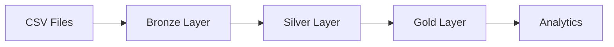
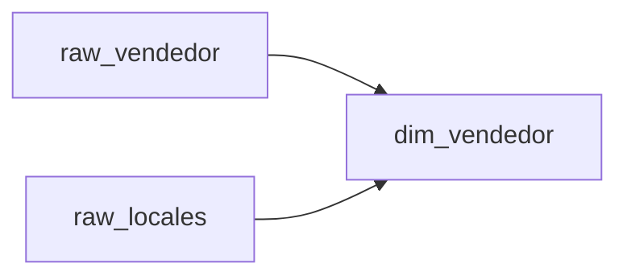
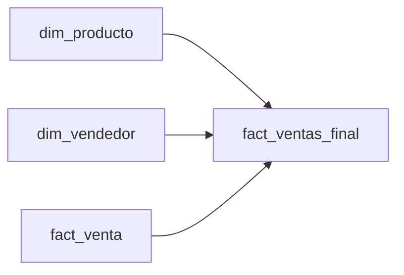
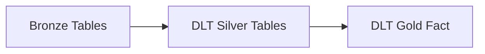
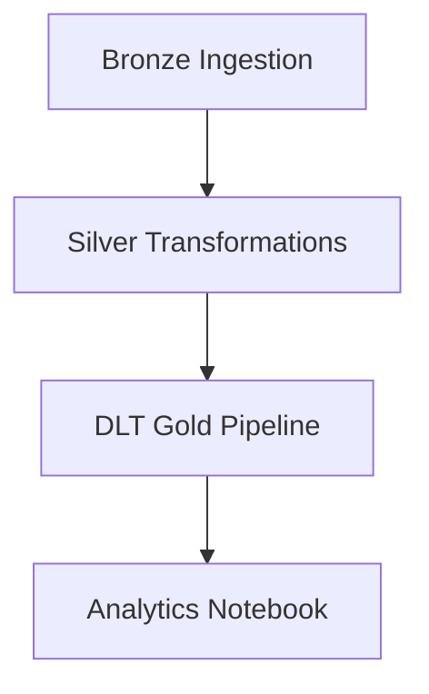

# End-to-End Data Platform with Medallion Architecture (Databricks Lakehouse)

## Project Overview

This project is a real-world enterprise Data Engineering solution built on the Databricks Lakehouse Platform following modern Databricks best practices used by consulting companies.

The solution implements:

- Medallion Architecture (Bronze → Silver → Gold)
- Delta Lake
- Unity Catalog
- Data Quality Validation
- Referential Integrity Validation
- Incremental Processing Design
- Databricks Workflows (Jobs)
- Lakeflow Declarative Pipelines (DLT)
- Analytics Consumption Layer
- Data Lineage and Governance


---

# Business Scenario

A retail company receives daily sales transactions from multiple stores.

The company needs a centralized Lakehouse platform to:

- Ingest raw data
- Validate data quality
- Build conformed dimensions
- Generate business-ready fact tables
- Enable analytics and reporting
- Automate execution pipelines

---

# Technology Stack

| Component | Technology |
|------------|------------|
| Data Platform | Databricks |
| Storage Format | Delta Lake |
| Catalog | Unity Catalog |
| ETL | SQL + PySpark |
| Orchestration | Databricks Workflows |
| Data Pipeline | Lakeflow Declarative Pipelines (DLT) |
| Version Control | Git + GitHub |
| Compute | Databricks Serverless |
| Data Governance | Unity Catalog |

---

# Data Model

## Source Files

### Fact Sales

```text
fact.csv
```

| Column |
|----------|
| sku |
| vendedor |
| cantidad |
| timestamp |

---

### Products

```text
producto.csv
```

| Column |
|----------|
| id_producto |
| familia |
| nombre |
| precio_unitario |

---

### Employees

```text
empleados.csv
```

| Column |
|----------|
| id_vendedor |
| sucursal |
| nombre |

---

### Stores

```text
locales.csv
```

| Column |
|----------|
| id_sucursal |
| sucursal_nombre |
| region |

---

# Medallion Architecture

## Architecture Overview



---

# Unity Catalog Structure

```text
workspace
│
├── bronze
│   ├── raw_fact
│   ├── raw_producto
│   ├── raw_vendedor
│   └── raw_locales
│
├── silver
│   ├── dim_producto
│   ├── dim_vendedor
│   └── fact_venta
│
└── gold
    └── fact_ventas_final
```

---

# Bronze Layer

## Objective

Store raw data exactly as received from source systems.

No business transformations are applied.

---

## Bronze Tables

```text
workspace.bronze.raw_fact
workspace.bronze.raw_producto
workspace.bronze.raw_vendedor
workspace.bronze.raw_locales
```

---

## Responsibilities

- Preserve source data
- Enable reprocessing
- Data lineage
- Raw audit layer

---

# Silver Layer

## Objective

Clean, standardize and validate data.

---

## Referential Integrity Validation

### Product Validation

```sql
SELECT COUNT(*)
FROM workspace.bronze.raw_fact f
LEFT JOIN workspace.bronze.raw_producto p
ON f.sku = p.id_producto
WHERE p.id_producto IS NULL
```

---

### Vendor Validation

```sql
SELECT COUNT(*)
FROM workspace.bronze.raw_fact f
LEFT JOIN workspace.bronze.raw_vendedor v
ON f.vendedor = v.id_vendedor
WHERE v.id_vendedor IS NULL
```

---

## Dimension: Product

```text
workspace.silver.dim_producto
```

### Transformations

- Cast IDs
- Remove duplicates
- Validate prices > 0
- Delta format

---

## Dimension: Vendor

```text
workspace.silver.dim_vendedor
```

### Attributes

| Column |
|----------|
| id_vendedor |
| vendedor_nombre |
| sucursal_nombre |
| region |

---

### Business Logic



---

## Fact Table

```text
workspace.silver.fact_venta
```

### Transformations

- Referential integrity enforcement
- Remove nulls
- Quantity > 0
- Date decomposition

---

### Final Schema

| Column |
|----------|
| id_producto |
| id_vendedor |
| cantidad |
| dia |
| mes |
| ano |
| ing_date |

---

# Gold Layer

## Objective

Provide analytics-ready datasets.

---

## Gold Architecture



---

## Gold Fact Table

```text
workspace.gold.fact_ventas_final
```

---

### Business Logic

```sql
monto_total =
cantidad * precio_unitario
```

---

### Additional Fields

| Column |
|----------|
| monto_total |
| gold_load_timestamp |

---

# Lakeflow Declarative Pipelines (DLT)

## Purpose

Automate Silver and Gold data transformations while enforcing data quality expectations.

---

## Pipeline

```text
ventas_pipeline
```

---

## DLT Data Quality Rules

### Fact Sales

```python
@dlt.expect_all_or_drop({
    "cantidad_positiva": "cantidad > 0",
    "producto_valido": "id_producto IS NOT NULL",
    "vendedor_valido": "id_vendedor IS NOT NULL"
})
```

---

## DLT Flow



---

# Databricks Workflow

## Enterprise Orchestration

The entire platform is orchestrated using Databricks Jobs.

---

## Workflow DAG



---

## Workflow Components

### Task 1

```text
01_bronze_ingestion
```

Responsibilities:

- Load raw files
- Create Bronze Delta tables

---

### Task 2

```text
02_silver_transformations
```

Responsibilities:

- Data cleansing
- Referential integrity
- Create dimensions
- Create fact table

---

### Task 3

```text
ventas_pipeline
```

Responsibilities:

- DLT execution
- Data quality validation
- Gold layer creation

---

### Task 4

```text
04_analytics
```

Responsibilities:

- KPI generation
- Business reporting
- Validation queries

---

# Analytics Examples

## Revenue by Region

```sql
SELECT
    region,
    SUM(monto_total) AS revenue
FROM workspace.gold.fact_ventas_final
GROUP BY region
ORDER BY revenue DESC
```

---

## Top Products

```sql
SELECT
    nombre,
    SUM(monto_total) revenue
FROM workspace.gold.fact_ventas_final
GROUP BY nombre
ORDER BY revenue DESC
LIMIT 10
```

---

## Sales Trend

```sql
SELECT
    ano,
    mes,
    SUM(monto_total)
FROM workspace.gold.fact_ventas_final
GROUP BY ano, mes
ORDER BY ano, mes
```

---

# Data Quality Controls

Implemented validations:

- Null handling
- Referential integrity
- Duplicate removal
- Positive quantities
- Positive prices
- DLT Expectations

---

# Delta Lake Features

Implemented:

- Delta Tables
- ACID Transactions
- Time Travel Ready
- Schema Enforcement

Recommended Production Optimizations:

```sql
OPTIMIZE workspace.gold.fact_ventas_final
ZORDER BY (id_producto)
```

---

```sql
VACUUM workspace.gold.fact_ventas_final
RETAIN 168 HOURS
```

---

# Project Repository Structure

```text
project/
│
├── notebooks/
│   ├── 01_bronze_ingestion
│   ├── 02_silver_transformations
│   └── 04_analytics
│
├── dlt/
│   └── ventas_pipeline.py
│
├── data/
│   ├── fact.csv
│   ├── producto.csv
│   ├── empleados.csv
│   └── locales.csv
│
├── docs/
│
└── README.md
```

---

# Skills Demonstrated

This project demonstrates:

- Delta Lake
- Unity Catalog
- SQL Advanced
- PySpark
- Data Modeling
- ETL/ELT
- Medallion Architecture
- Data Quality
- Referential Integrity
- Lakeflow Declarative Pipelines
- Databricks Workflows
- Production Data Engineering Practices

---

# Future Improvements

- Auto Loader ingestion
- Streaming ingestion
- SCD Type 2 Dimensions
- CI/CD with GitHub Actions
- Databricks Asset Bundles
- Automated Unit Testing
- Monitoring & Alerting
- Data Contracts
- Data Observability

# Author

Sebastián Monsalve Gómez

Data Engineer | Databricks | PySpark | SQL | Delta Lake

End-to-End Lakehouse Data Platform Project
