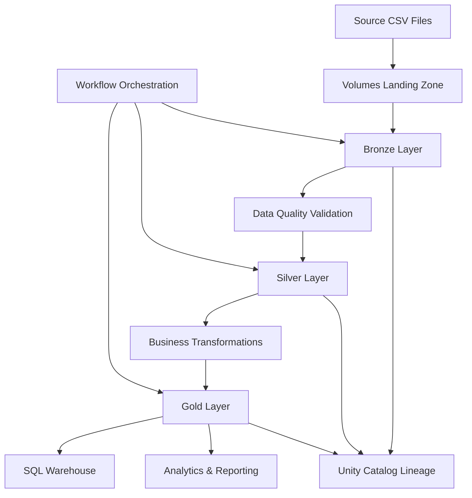
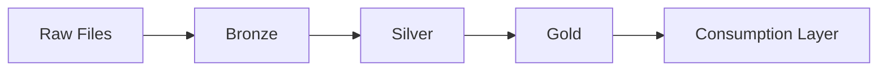
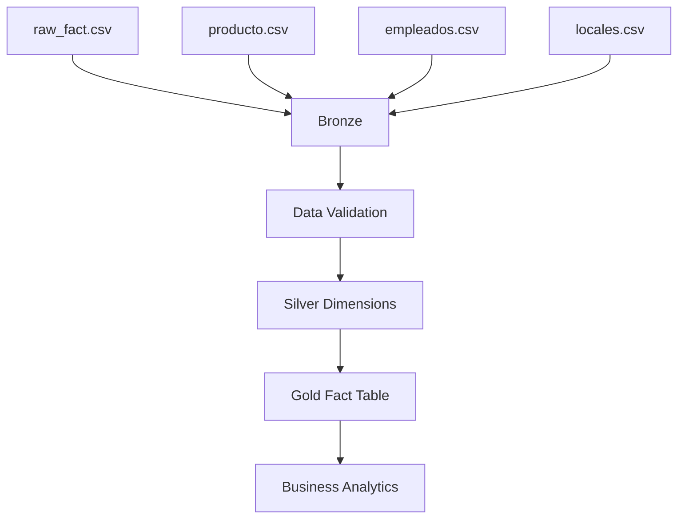
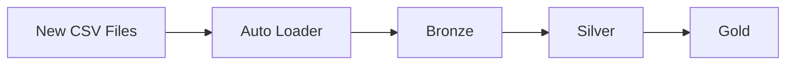
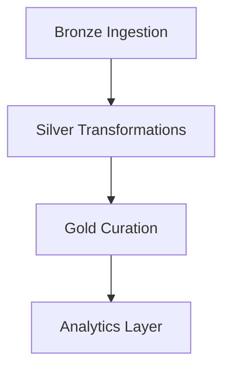

# End-to-End Lakehouse Data Platform on Databricks

## Overview

This project implements a complete modern Data Platform using Databricks Lakehouse Architecture following industry best practices commonly used by consulting firms specialized in Data & AI.

The solution follows the Medallion Architecture pattern:



---

# Architecture

## Medallion Architecture



### Bronze Layer

Purpose:

- Store raw data exactly as received
- Preserve source information
- Enable reprocessing
- Support incremental ingestion

Characteristics:

- Minimal transformations
- Append-only
- Delta Tables
- Source metadata

---

### Silver Layer

Purpose:

- Data cleansing
- Data standardization
- Referential integrity validation
- Business-ready datasets

Characteristics:

- Remove invalid records
- Deduplicate data
- Cast datatypes
- Handle null values

---

### Gold Layer

Purpose:

- Business consumption
- KPIs
- Aggregations
- Reporting

Characteristics:

- Star-schema style modeling
- Fact and Dimension tables
- Optimized for analytics

---

# Technology Stack

| Technology | Purpose |
|------------|----------|
| Databricks | Data Platform |
| Delta Lake | Storage Layer |
| Unity Catalog | Governance |
| Auto Loader | Incremental Ingestion |
| PySpark | Data Engineering |
| SQL | Analytics |
| Workflows | Orchestration |
| GitHub | Version Control |
| SQL Warehouse | Consumption Layer |

---

# Repository Structure

```text
ventas-lakehouse-databricks/

│
├── notebooks/
│   │
│   ├── 01_bronze_ingestion
│   ├── 02_silver_transformations
│   ├── 03_gold_curation
│   └── 04_analytics
│
├── dlt/
│   │
│   └── ventas_pipeline.py
│
├── sql/
│   │
│   └── analytics_queries.sql
│
├── docs/
│   │
│   └── architecture.md
│
├── workflows/
│   │
│   └── job_definition.md
│
└── README.md
```

---

# Unity Catalog Structure

```text
workspace

├── bronze
│   ├── raw_fact
│   ├── raw_producto
│   ├── raw_empleados
│   └── raw_locales
│
├── silver
│   ├── dim_producto
│   ├── dim_vendedor
│   └── fact_venta
│
├── gold
│   └── fact_ventas_final
│
└── audit
    └── pipeline_log
```

---

# Data Flow



---

# Data Quality Rules

## Fact Table

Validate:

- SKU exists in Product Dimension
- Vendor exists in Vendor Dimension
- Quantity > 0
- Date not null

---

## Product Dimension

Validate:

- Product ID not null
- Unit Price > 0

---

## Vendor Dimension

Validate:

- Vendor ID not null
- Branch exists
- Region exists

---

# Incremental Processing

The platform supports incremental ingestion using Auto Loader.



Features:

- Schema evolution
- Checkpointing
- Idempotent execution

---

# Workflow Orchestration



Workflow Features:

- Retry Policy
- Dependency Management
- Scheduling
- Monitoring

---

# Logging Architecture

Audit table:

```text
workspace.audit.pipeline_log
```

Columns:

| Column | Description |
|----------|-------------|
| pipeline_name | Executed process |
| execution_time | Execution timestamp |
| records_processed | Number of processed rows |
| status | SUCCESS / FAILED |

---

# Delta Lake Optimization

Implemented:

## Partitioning

```sql
PARTITIONED BY (mes)
```

---

## ZORDER

```sql
OPTIMIZE workspace.gold.fact_ventas_final
ZORDER BY (id_producto);
```

---

## History

```sql
DESCRIBE HISTORY workspace.gold.fact_ventas_final;
```

---

## Metadata

```sql
DESCRIBE DETAIL workspace.gold.fact_ventas_final;
```

---

# Analytical KPIs

Examples:

## Revenue by Product

```sql
SELECT
    id_producto,
    SUM(monto_total)
FROM workspace.gold.fact_ventas_final
GROUP BY id_producto;
```

---

## Revenue by Region

```sql
SELECT
    region,
    SUM(monto_total)
FROM workspace.gold.fact_ventas_final
GROUP BY region;
```

---

## Top Vendors

```sql
SELECT
    vendedor_nombre,
    SUM(monto_total)
FROM workspace.gold.fact_ventas_final
GROUP BY vendedor_nombre
ORDER BY SUM(monto_total) DESC;
```

---

# Git Workflow

Feature Branch Strategy

```text
main

├── feature/bronze
├── feature/silver
├── feature/gold
├── feature/dlt
└── feature/workflow
```

Typical Commands

```bash
git checkout -b feature/bronze

git add .

git commit -m "Implemented Bronze Layer"

git push origin feature/bronze
```

---

# Enterprise Best Practices

Implemented:

- Medallion Architecture
- Delta Lake
- Unity Catalog
- Data Quality Rules
- Referential Integrity
- Partitioning
- ZORDER
- Workflow Orchestration
- Git Version Control
- Incremental Loads
- Audit Logging

---

# Future Improvements

- Delta Live Tables
- Lakeflow Declarative Pipelines
- Data Contracts
- CI/CD with GitHub Actions
- Databricks Asset Bundles
- Unit Testing Framework
- Automated Data Quality Monitoring

---

# Author

Sebastián Monsalve Gómez

Data Engineer | Databricks | PySpark | SQL | Delta Lake

End-to-End Lakehouse Data Platform Project
